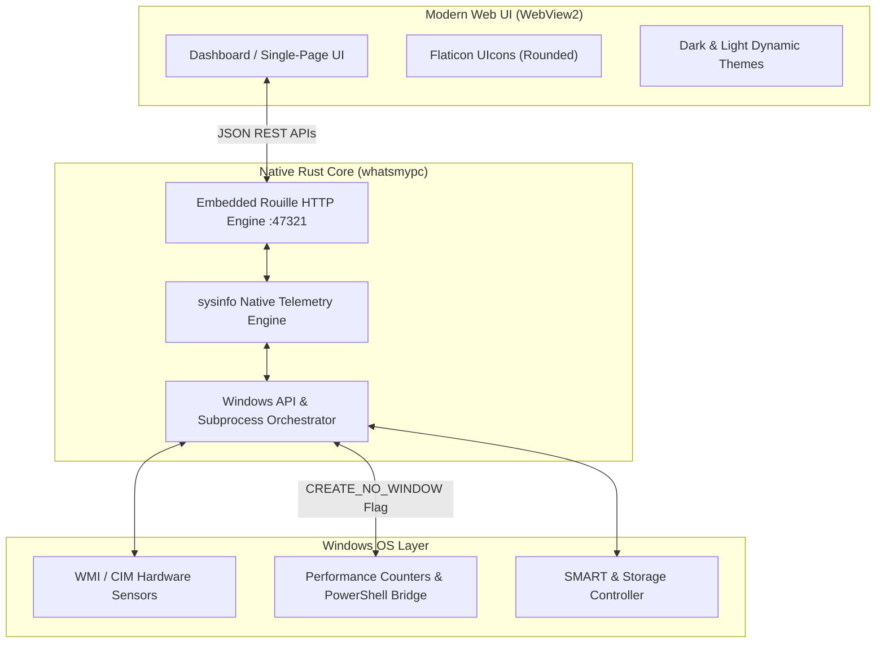

<div align="center">

  

  # WhatsMyPC

  **A sleek, lightning-fast hardware telemetry & system intelligence dashboard for Windows built with Rust & WebView2.**

  <p align="center">
    <a href="#key-features">Key Features</a> •
    <a href="#quick-start--installation">Installation</a> •
    <a href="#architecture">Architecture</a> •
    <a href="#building-from-source">Build from Source</a> •
    <a href="#keyboard-shortcuts">Shortcuts</a> •
    <a href="#license">License</a>
  </p>

  <p align="center">
    
    
    
    
    
  </p>

</div>

---

## ⚡ Overview

**WhatsMyPC** is a lightweight, zero-bloat Windows desktop utility designed to give you a complete, granular view of your PC's hardware and telemetry in real time.

Unlike heavy Electron-based or web-wrapped tools, **WhatsMyPC** is compiled into a native **Rust binary** backed by Microsoft's hardware-accelerated **WebView2** engine. It launches instantly, uses minimal memory, and runs completely silent in the background with zero annoying command-prompt popups.

---

## 🌟 Key Features

### 🖥️ 1. Hardware & System Telemetry
- **Overview Dashboard**: High-level health index, OS edition/build, hostname, uptime, and last boot timestamp.
- **CPU Deep Dive**: Model, core/thread count, base/boost frequency, architecture, per-core utilization meters, real-time frequency, and top processes.
- **Memory & Paging**: Live physical and virtual swap memory tracking, RAM speed, form factor (DDR4 / DDR5), slot configurations, and channel bandwidth.
- **GPU Diagnostics**: Real-time VRAM allocation, GPU core load, temperature, driver versions, and multi-GPU enumeration (Dedicated & Integrated).
- **Storage & Drive Health**: Drive type classification (NVMe, SSD, HDD), partitioned usage, live I/O activity, and S.M.A.R.T. health status.
- **Network Stats**: Active adapters (Wi-Fi, Ethernet), local IPv4/IPv6, MAC, gateway, DNS, live throughput charts, and ping latency.
- **Battery & Power (Laptops)**: Charge level, charging rate, estimated battery health (designed vs. current capacity), and cycle count.

### 🛠️ 2. Built-in Power Tools
- **1-Click Clean Specs Copier**: Instantly copies a clean, human-readable summary (CPU, RAM, OS, Storage, GPU) to the clipboard for Discord, Reddit, or tech support.
- **Always-on-Top Gaming Overlay**: Floating mini HUD displaying current FPS, CPU/GPU load, and thermals while gaming or running intensive workloads.
- **Instant Screenshot Capture**: Capture clean, high-resolution snapshots of your hardware overview directly to your clipboard or file.
- **Built-in Speed & Latency Test**: Verify your network response time without opening third-party web trackers.
- **Smart Spotlight Search (`Ctrl + K`)**: Jump directly to any hardware section, disk, or setting instantly.
- **Customization**: Dark / Light theme toggle with high-contrast Orange accent palette and rounded Flaticon UIcons.

---

## 🚀 Quick Start & Installation

### Option 1: Windows Installer (.msi) — *Recommended*
Download the latest `WhatsMyPC-v1.0.0.msi` from the [Releases](https://github.com/anuzdhk/WhatsMyPC/releases) page or locate it in the `WhatMyPC_Final` folder:
1. Double-click **`WhatsMyPC-v1.0.0.msi`**.
2. Follow the setup prompts.
3. Access **WhatsMyPC** directly from your Windows Start Menu or Desktop shortcut.

### Option 2: Portable Package
No installation needed! Download `WhatsMyPC-v1.0.0-Portable.zip`, unpack the archive anywhere, and run `WhatsMyPC.exe`.

---

## ⌨️ Keyboard Shortcuts

| Shortcut | Action |
| :--- | :--- |
| <kbd>Ctrl</kbd> + <kbd>K</kbd> | Open Quick Search & Command Palette |
| <kbd>Ctrl</kbd> + <kbd>C</kbd> | Copy Essential Specs to Clipboard |
| <kbd>Ctrl</kbd> + <kbd>S</kbd> | Capture Screenshot of Dashboard |
| <kbd>Ctrl</kbd> + <kbd>O</kbd> | Toggle Floating Gaming Overlay |
| <kbd>Esc</kbd> | Close Modals / Clear Search |

---

## 🏗️ Architecture



### Highlights:
- **No Console Popups**: Child processes and telemetry probes use Windows `CREATE_NO_WINDOW (0x08000000)` and `-WindowStyle Hidden` flags for completely silent background polling.
- **Native Window Host**: Powered by `tao` and `wry`, eliminating the multi-hundred megabyte overhead of Chromium browsers.
- **Offline Capable**: Bundled with all local assets, SVG icons, and styles.

---

## 🛠️ Building from Source

### Prerequisites
1. **Rust & Cargo** (1.75+ recommended):
   ```powershell
   winget install Rustlang.Rustup
   ```
2. **Microsoft Edge WebView2 Runtime** (installed by default on Windows 10/11).
3. **WiX Toolset v7** *(optional, only needed for building the `.msi`)*:
   ```powershell
   dotnet tool install --global wix
   ```

### Build Executable
```powershell
# Clone the repository
git clone https://github.com/anuzdhk/WhatsMyPC.git
cd WhatsMyPC/pcpedia_rust

# Build optimized release binary
cargo build --release
```
The compiled executable will be located at:
```
pcpedia_rust/target/release/whatsmypc.exe
```

### Build MSI Package
```powershell
cd WhatMyPC_Final
wix build "WhatsMyPC.wxs" -o "WhatsMyPC-v1.0.0.msi"
```

---

## 📋 Clipboard Specs Format Sample

When you click **Copy Specs** or press <kbd>Ctrl</kbd> + <kbd>C</kbd>, WhatsMyPC outputs a clean summary:

```text
==================================================
                 WhatsMyPC Specs
==================================================
CPU:     AMD Ryzen 7 5800H with Radeon Graphics (8 Cores, 16 Threads)
RAM:     16 GB DDR4 (3200 MHz)
OS:      Windows 11 Home Single Language (Build 26100.2894)
Storage: 512 GB NVMe SSD (280 GB Free)
GPU:     NVIDIA GeForce RTX 3060 Laptop GPU (6 GB VRAM)
==================================================
Generated by WhatsMyPC
```

---

## 🤝 Contributing

Contributions, feature requests, and bug reports are welcome!
1. Fork the Project
2. Create your Feature Branch (`git checkout -b feature/AmazingFeature`)
3. Commit your Changes (`git commit -m 'Add some AmazingFeature'`)
4. Push to the Branch (`git push origin feature/AmazingFeature`)
5. Open a Pull Request

---

## 📄 License

Distributed under the **MIT License**. See `LICENSE` for more information.

<div align="center">
  <sub>Crafted with ❤️ and Rust for Windows.</sub>
</div>
